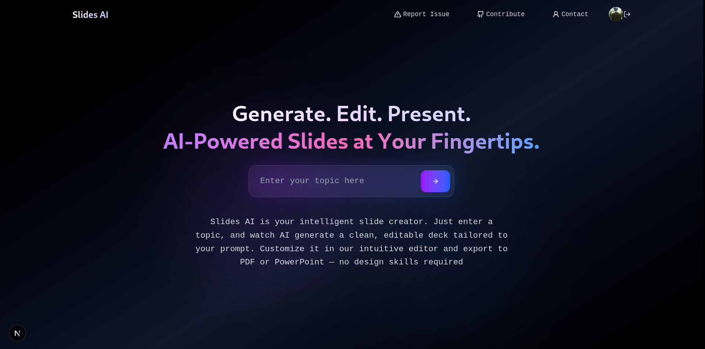
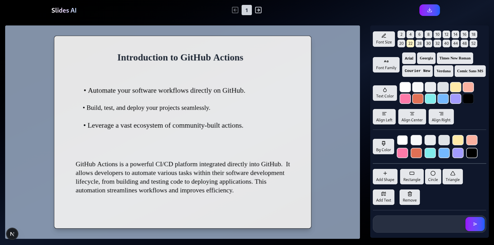

# Slides AI

Slides AI is a web application that generates editable presentation slides from a text prompt. Slides can be customized and exported as PDF or PowerPoint.

## Features

- AI-based slide generation from a topic prompt
- Editor with toolbox (fonts, colors, alignment, shapes)
- Export to PDF or PowerPoint
- Google login/logout support

## Tech Stack

- Frontend: Next.js, React, Tailwind CSS, Zustand, Shadcn UI
- Backend: Next.js API Routes, Prisma ORM, PostgreSQL
- Authentication: NextAuth
- AI: Gemini (Google GenAI SDK)
- Canvas Editing: Fabric.js
- Export: pptxgenjs, jsPDF

## Screenshots

### Landing



### Workspace



## Local Setup

### 1. Clone the repository

```bash
git clone https://github.com/yourusername/slides-ai
cd slides-ai
```

### 2. Install dependencies

```bash
npm install
```

### 4. Create .env file in the root directory

- Duplicate `.env.example` to `.env`
- Replace dummy values with actual variables

### 5. Set up the database

```bash
npm run db:push
```

### 6. Start the development server

```bash
npm run dev
```
